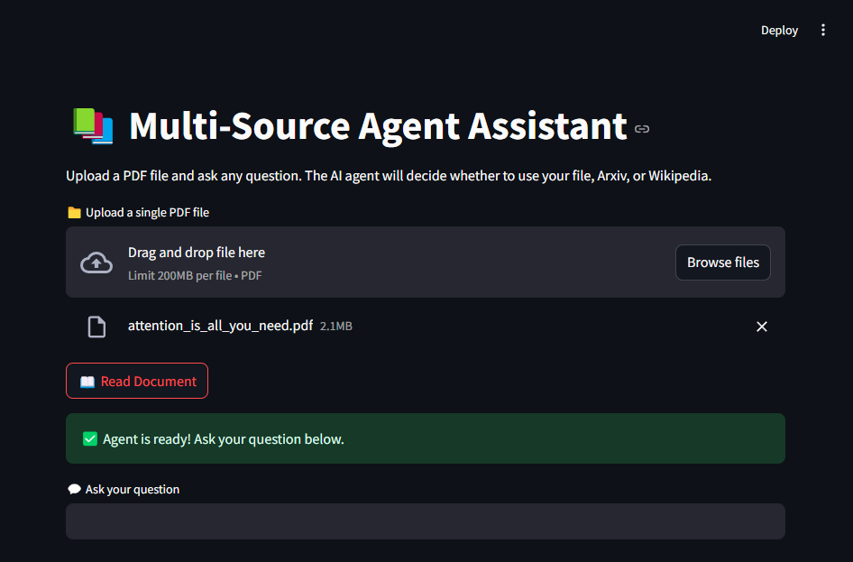
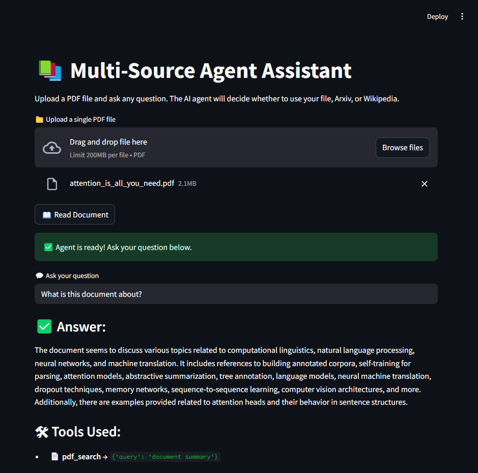
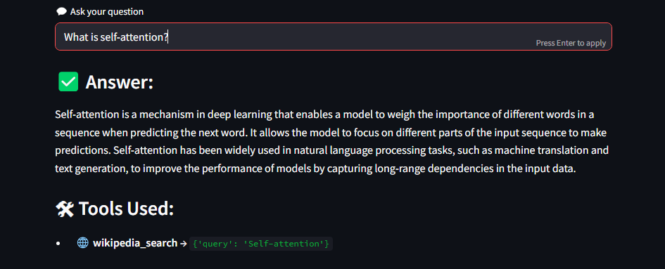

# Multi-Source RAG App
 
An intelligent question-answering app using **LangChain agents** with **OpenAI**, **Pinecone**, and **Streamlit**. Supports PDF uploads and fallbacks to Arxiv or Wikipedia via **RAG** and custom retrievers, all orchestrated through a multi-tool agent system. 

---
## Contents

- [Features](#features)
- [Tech Stack](#tech-stack)
- [Usage](#usage)
- [How to Install](#how-to-install)
- [Development](#development)
- [Testing](#testing)
- [License](#license)

---
## Features

- **Document Q&A**: Upload PDFs and ask questions directly
- **Multi-source RAG**: If no answer is found in the document, fall back to Arxiv or Wikipedia 
- **LangChain agent system**: LLM intelligently selects the best tool for each question
- **OpenAI LLM integration**: Uses GPT-3.5 to generate accurate answers
- **Tool usage transparency**: Displays which source/tool was used in the UI
- **Pinecone vector search**: Fast and scalable document retrieval
- **Streamlit UI**: Clean, interactive interface for asking and viewing results
- **Dockerized**: Easy to run, test, or deploy anywhere

---
## Tech Stack

- **Frontend**: Streamlit
- **Backend**: LangChain Agents (multi-tool reasoning with custom retrievers)
- **LLM Provider**: OpenAI API (gpt-3.5-turbo)
- **Embeddings**: OpenAI Embeddings
- **Vector Database**: Pinecone
- **Document Loaders**: LangChain PDF/Text Loaders
- **Containerization**: Docker
- **Testing**: Pytest 

---
## Usage

- Upload a PDF file and read the document



- Make any question!




---

## How to Install

1. Clone the repository

```bash
git clone https://github.com/idalz/multi-source-rag-app.git
```

2. Create a virtual environment

```bash
python -m venv venv
source venv/bin/activate  # On Windows: venv\Scripts\activate
```

3. Install dependencies

```bash
pip install -r requirements.txt
```

4. Set up environment variables (root folder)

```bash
OPENAI_MODEL=gpt-3.5-turbo
OPENAI_API_KEY=<your-openai-api-key>
PINECONE_API_KEY=<your-pinecone-api-key>
PINECONE_INDEX_NAME=<your-pinecone-index-name>
```

5. Docker Setup:

Run the following command to start the application  container:

```bash
docker-compose up --build
```

The application will run at http://localhost:8501

---
## Development

If you'd like to run locally (without Docker), follow instruction above and run  the streamlit app:

```bash
streamlit run app/main.py
```

---
## Testing
If you would like to run tests, ensure you installed `pytest`:

```bash
pip install pytest
```

---
## License

This project is licensed under the [MIT License](LICENSE).
